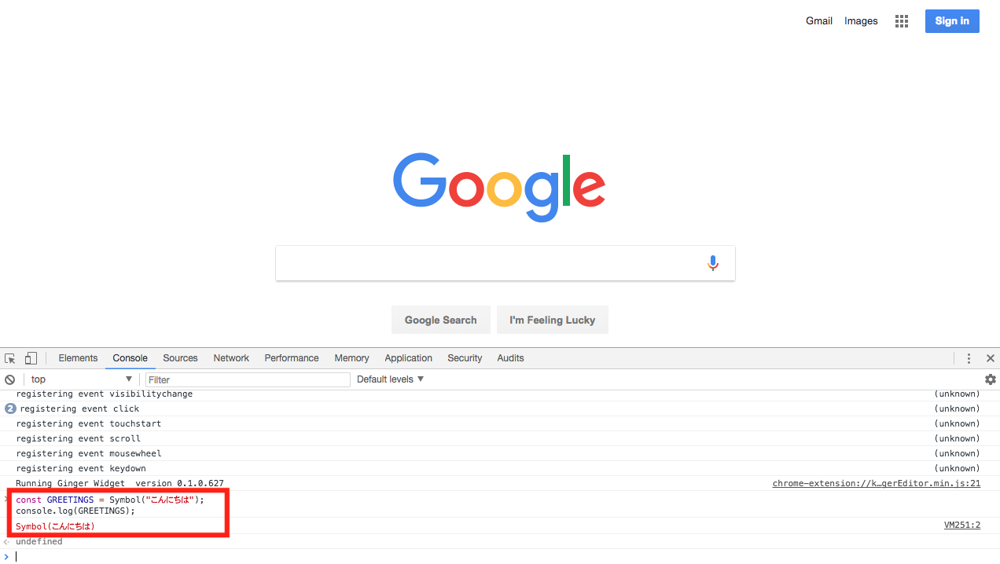

## Set

SetもES6で新たに導入されたオブジェクト型です。Setは配列に非常によく似ており複数のリファレンス型やプリミティブ型の値を保持することが出来ます。Arrayとの大きな違いとして**Setは重複した値を持つことが出来ません**。Setを利用するのに便利なのはコレクションがある値を持つかどうかチェックしたい場合です。

- **Setの基本的な使い方**

```javascript
let set1 = new Set(); // 空のSetを作成する。
let set2 = new Set([1,2,3]); // 値を持つSetを作成する。
let person = {
  name: "Steve Jobs",
  email: "steve@apple.com"
}

// size関数を使い、Setの値の数をチェックする。
console.log(set1.size); // 0
console.log(set2.size); // 3

// add関数を使い、Setに値を追加する。
set1.add("1");
set1.add(1);
set1.add(person);

// has関数を使い、Setに値があるかどうかをチェックする。
console.log(set1.has(1)); // true

// 重複する値は保存されない。
console.log(set1.size); // 3
set1.add("1");
console.log(set1.size); // 3

// forEach関数で繰り返し処理を行う。
set1.forEach((item) => {
  console.log(item);
})

// Setから値を消去する。
set1.delete(1);
console.log(set1.size); // 2

// 全ての値を消去する。
set1.clear();
console.log(set1.size); // 0
```

- **Setを配列に変換する**

Setと配列は非常によく似ているため、Setを配列に返還することも簡単に出来ます。また、先ほど学んだspreadオペレーターと組み合わせることで重複をなくした配列を簡単に作ることが出来ます。

```javascript
let arr1 = [1,3,1,2,4,3]; // 重複を持つ配列
let set1 = new Set(arr1); // 配列からSetを作成する。
let arr2 = [...set1]; // スプレッドオペレーターを利用して、Setを配列に変換する。

console.log(arr2); // [1,3,2,4];
```

## Map

Mapはkey-valueペアを格納することの出来るコレクションです。ES5まではObjectがMapの代わりとして使われていました。しかし、Objectの場合は、keyとしてString型かSymbol型の値しか取ることが出来ないという問題がありました。またObjectの要素に対して繰り返し処理を行う場合、まずkeyを得てからそのkeyで要素のvalue(値)を得るという手間がありました。

以下はObjectをkey-valueペアのコレクションとして利用した場合の例です。

```javascript
let obj1 = {
  1: "One", // 数字をkeyにしても強制的に"1"というStringに変換される。
  2: "Two",
  3: "Three"
}

let keys = Object.keys(obj1); // 繰り返し処理のためにkeyを配列としてまず得る。
console.log(keys[1]); // "1"

keys.forEach((key) => {
  console.log(obj1[key]);
});
```

上記のような、Objectを利用した場合の手間がMapではなく、またObjectに比べて高速で繰り返し処理を行うことが出来ます。

- **Mapの基本的な使い方**

```javascript

let map1 = new Map(); // 空のMapを作成する。
let map2 = new Map([
  [1, "One"],
  [2, "Two"],
  [3, "Three"]
]); // 要素を持つMapを作成する。

// set関数でMapにkey-valueペアを格納する。
map1.set("apple", "Apple");

// get関数でMapから値を得る。
console.log(map1.get("apple")); // "Apple"

// size関数でMap内の要素の数を得る。
console.log(map2.size); // 3

// has関数でMapに要素があるかどうか調べる。
console.log(map2.has("1")); // false
console.log(map2.has(1)); // true

// for...of関数で繰り返し処理を行う。
for (let [key, value] of map2) {
  console.log(`key: ${key} - value: ${value}のペアです。`);
}

// forEach関数を利用して繰り返し処理を行う。valueとkeyの順番に注意。
map2.forEach((value, key) => {
  console.log(`key: ${key} - value: ${value}のペアです。`);
});
```

## Symbol

### シンボル

ES5にはなかったシンボルがES6では使用できるようになりました。シンボルはオブジェクトに似ているため、作成されたシンボルは全てユニーク、つまりどれ一つとして同じになるシンボルはないと言う特徴があります。

シンボルはプリミティブ（基本型）で、リテラル（テキスト文字）表現を持たないことも特徴です。

シンボルは以下のように書くことで使用できます。

```js
const GREETINGS = Symbol("こんにちは");
console.log(GREETINGS); // Symbol(こんにちは)
```



 `Symbol(こんにちは)` が返ってきました。

シンボルがユニークなことである証拠を確かめてみましょう。
１つの例として、 `厳密等価演算子` の `===` を使用して確かめます。

厳密等価演算子は、以下のケースかどうかを確かめることができます。
（詳しくはClass 3へ。）

| 厳密等価演算子として見なされる基準 |  |
| ------------- | -----:|
| 同じオブジェクトを参照 | プリミティブ型で、データ型も値も同じ |

これだけでは少し理解が難しいので、簡単な厳密等価演算子の例を先に見てみましょう。

```js
const one = 1;
const literalOne = "1";
console.log(one === literalOne); // false
```

同じ `1` を変数に入れたのに、なぜ `false` が返ってきたのでしょうか？
これは、１行目の `one` の1は数値で、２行目の `literalOne` は文字列としての1という `データ型の違い` （文字列と数値という違い）があり、厳密等価演算子では `false` つまり one と literalOne は同じ１ではないと見なされます。

話を元に戻すと、シンボルがユニーク、つまり１つ１つ異なるものであることを証明するために厳密等価演算子を使用してみましょうとなっていたので、上記の例を利用します。

先ほどの例が同じ１でも、データ型が異なっていたために `false` になったのであれば、データ型の違いはなくても、１つ１つがユニークでお異なるシンボルは同じ名前のシンボルでも `false` となるはずです。

```js
const me = Symbol("私");
const watashi = Symbol("私");
console.log(me === watashi);// false
```

これは、特にオブジェクトとオブジェクト指向プログラミングにおいて、識別子を区別する際にとても役立ちます。

オブジェクトに新しいプロパティを加える時に、他に既存のプロパティと同じ識別子になってしまい、競合するというリスクをなくすことができます。

## 更に学ぼう

### 記事で学ぶ

- [分割代入 - Mozilla](https://developer.mozilla.org/ja/docs/Web/JavaScript/Reference/Operators/Destructuring_assignment)
- [Map - Mozilla](https://developer.mozilla.org/ja/docs/Web/JavaScript/Reference/Global_Objects/Map)
- [Symbol - Mozilla](https://developer.mozilla.org/ja/docs/Web/JavaScript/Reference/Global_Objects/Symbol)
- [Rest parameters - Mozilla](https://developer.mozilla.org/ja/docs/Web/JavaScript/Reference/Functions_and_function_scope/rest_parameters)
